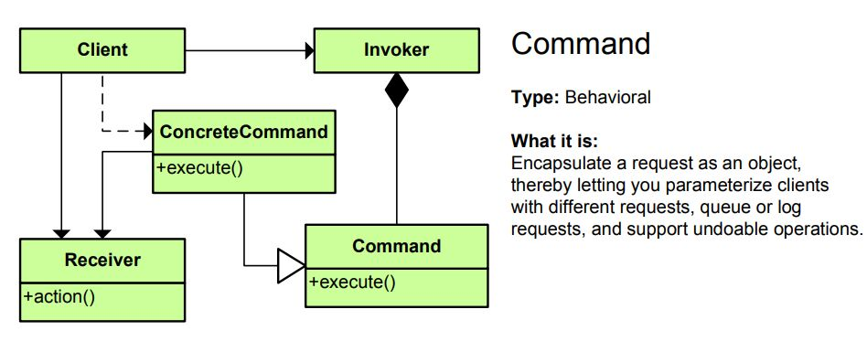

# 前言
&emsp;&emsp; 设计模式是软件工程中一些问题的统一解决方案的模型,它的出现是为了解决一些普遍存在的,却不能被语言特性直接解决的问题,随着软件工程的发展,设计模式也会不断的进行更新,本文介绍的是经典设计模式-命令模式以及来自java8的lambda的对它的优化。

### 什么是命令模式
> 命令模式把一个请求或者操作封装到一个对象中。命令模式允许系统使用不同的请求把客户端参数化，对请求排
队或者记录请求日志，可以提供命令的撤销和恢复功能。 (摘自<大话设计模式>)

&emsp;&emsp;我不想把问题弄的特别复杂,我的理解是,命令模式就是对一段命令的封装,而命令,就是行为,行为在java语言里可以理解为方法,所以说命令模式就是对一些行为或者说是一些方法的封装。下面我举一个简单的例子来描述这种模式,然后再讲解它的特点。

# 例子
## 场景描述
&emsp;&emsp;有一家路边的小摊,做的小本经营,只有一个做饭的师傅,师傅饭做的还不错,可来吃饭的人们总是抱怨老板记性不好,有时候订单一多就给忘了，路人甲:"老板!来份牛肉饭!",老板:"好勒!马上给您做!"，路人乙:"老板!来份啤酒鸭!",老板:"没问题!",路人丙:"老板!一份西红柿炒鸡蛋!",老板:"ok!",路人丁:"老板!两份啤酒鸭!",老板:"好的好的!"(内心：我晕,怎么有点记不过来了...)
## 基础实现
老板在这里同时扮演了做饭的角色 对于一个餐馆来说也就是厨房类
```java
public class Kitchen {
    public void beefRice(){
        System.out.println("一份牛肉饭做好了!");
    }

    public void scrambledEggsWithTomatoes(){
        System.out.println("一份西红柿炒鸡蛋做好了!");
    }

    public void beerDuck(){
        System.out.println("一份啤酒鸭做完啦!");
    }
}

```
客户端代码
```java
class Client{
public static void main(String[] args){
    Kitchen boss = new Kitchen();
    boss.beefRice();
    boss.beefRice();
    boss.beerDuck();
    boss.beerDuck();
    boss.beerDuck();
    boss.beefRice();
}
}
```
代码十分的简单,可是通过观察发现,客户和厨房直接交互了,如果一旦请求多了起来,就如同上面老板说的,怎么感觉头有点晕那...从代码的角度来说,这样的耦合度也太高了,举个例子,如果现在有一个客户不想点了,那应该怎么办呢?取消订单代码写在Kitchen类里,显然不现实,写在客户端里,似乎又不太靠谱.... 再举一个例子,鸡蛋已经用完了,不能给客户提供西红柿炒鸡蛋了,那这个拒绝的代码又写在哪里呢?写在Kitchen？可以是可以,但是你把业务逻辑和基础领域模型混在一起真的好吗?写在客户端里？所有的逻辑都丢在客户端第一层显然是不明智的。

废话了半天,终于有一个顾客受不了了:"老板你这样也太累了吧!不如招个服务员给你记我们要点的饭的订单,记完了送到厨房给你,你按照这个订单做就行了,这样你全身心的投入做饭,这样能提高做饭的效率,也不会出现先点的顾客您忘记做等了半天嚷嚷着要退钱了！至于取消修改订单还是拒绝订单,都交给服务员去处理,处理好了送过来给您,这样各司其职,效率变高了,大家不是都开心嘛!"

那么很显然故事中的这个顾客就很有软件工程的天赋 :)

##使用传统命令模式实现
命令模式,就是上文中的顾客所提出的建议,下面就是具体的实现类。

- 首先要添加服务员类,负责添加,拒绝,修改或者删除订单,或者增加订单的日志相关信息,其实非常简单,简单的增加逻辑即可,这里为了演示,只演示拒绝订单和输出日志
- 其次既然是命令模式,那肯定要有命令类,这里将厨房做饭的三个方法分别构造成三个命令对象,将他们的共同部分抽象成公共的抽象命令类,方便后面向上转型。

以下为代码
抽象命令类,包含一个执行命令的对象和方法,子类继承该类,对抽象的实现方法进行不同的实现
```java
public abstract class BaseCommand {
    protected Kitchen kitchen;

    public BaseCommand(Kitchen kitchen) {
        this.kitchen = kitchen;
    }

    public abstract void executeCommand();
}
```

下面是三个继承抽象命令类的具体命令,也就是将来客户端要添加的具体的独立的订单命令,结构完全一样

做牛肉饭命令类
```java
public class beefRiceCommand extends BaseCommand {

    public beefRiceCommand(Kitchen kitchen) {
        super(kitchen);
    }

    @Override
    public void executeCommand() {
       kitchen.beefRice();
    }
}
```
做啤酒鸭命令类
```java
public class beerDuckCommand extends BaseCommand {

    public beerDuckCommand(Kitchen kitchen) {
        super(kitchen);
    }

    @Override
    public void executeCommand() {
       kitchen.beerDuck();
    }
}
```
做西红柿炒鸡蛋命令类
```java
public class EggsWithTomatoesCommand extends BaseCommand {

    public EggsWithTomatoesCommand(Kitchen kitchen) {
        super(kitchen);
    }

    @Override
    public void executeCommand() {
        kitchen.scrambledEggsWithTomatoes();
    }
}
```

下面是服务员类,这里为了演示使用队列实现了增加订单与拒绝订单和添加日志,删除中间订单也很简单,数据结构换成linkedList或者arrayList即可,拒绝订单为了演示只是简单的通过类名来判断
```java
public class Waiter {
    /** 用于存储订单命令的队列 */
    private final Queue<BaseCommand> orders ;

    public  Waiter() {
        orders = new ArrayDeque<>();
    }

    /**
     * 添加订单
     * @param baseCommand 客户端传来的命令类,向上转型
     */
    public final void setOrders(BaseCommand baseCommand){
        if (baseCommand.getClass().getName().equals(EggsWithTomatoesCommand.class.getName())) {
            System.out.println("啤酒鸭卖完了，换一个点点吧!");
        } else {
            String[] names = baseCommand.getClass().getName().split("\\.");
            System.out.printf("添加订单: %s 订单时间: %s \n", names[names.length - 1], LocalDateTime.now());
            orders.add(baseCommand);
        }
    }

    /**
     * 通知厨房开始做饭,遍历队列,做完了的订单移出队列
     */
    public final void notifyKitchen(){
        while (orders.peek() != null) {
            orders.peek().executeCommand();
            orders.remove();
        }
    }
}
```

客户端类
```java
public class Client {
    public static void main(String[] args) {
        //准备厨房,服务员,菜单命令工作
        Kitchen kitchen = new Kitchen();
        Waiter waiter = new Waiter();
        BaseCommand beefRiceCommand = new beefRiceCommand(kitchen);
        BaseCommand beerDuckCommand = new beerDuckCommand(kitchen);
        BaseCommand eggsWithTomatoesCommand = new EggsWithTomatoesCommand(kitchen);

        //开始营业
        System.out.println("=======================添加订单环节=======================");
        // 顾客：服务员 一份牛肉饭!
        waiter.setOrders(beefRiceCommand);
        // 顾客：服务员 一份啤酒鸭!
        waiter.setOrders(beerDuckCommand);
        // 顾客：服务员 一份西红柿炒鸡蛋!
        waiter.setOrders(eggsWithTomatoesCommand);
        // 顾客：服务员 两份啤酒鸭!
        waiter.setOrders(beerDuckCommand);
        waiter.setOrders(beerDuckCommand);

        System.out.println("==========服务员将订单送至厨房,厨房按照订单顺序开始做饭=========");
        //服务员通知厨房按照订单顺序开始做
        waiter.notifyKitchen();

    }
}
```

运行结果
```
=======================添加订单环节=======================
添加订单: beefRiceCommand 订单时间: 2017-10-16T02:44:13.631 
添加订单: beerDuckCommand 订单时间: 2017-10-16T02:44:13.650 
啤酒鸭卖完了，换一个点点吧!
添加订单: beerDuckCommand 订单时间: 2017-10-16T02:44:13.650 
添加订单: beerDuckCommand 订单时间: 2017-10-16T02:44:13.650 
==========服务员将订单送至厨房,厨房按照订单顺序开始做饭=========
一份牛肉饭做好了!
一份啤酒鸭做完啦!
一份啤酒鸭做完啦!
一份啤酒鸭做完啦!

Process finished with exit code 0
```
## 总结与思考
### 总结
上面的例子应该并不难理解,这里列出命令模式的uml图<来源于《head first》>

命令模式涉及到五个角色，它们分别是：

- 客户端(Client)角色：具体执行程序的地方,创建一个具体命令(ConcreteCommand)对象并确定其接收者。
- 命令(Command)角色 : 声明了一个给所有具体命令类的抽象接口,在上面的例子中是BaseCommand类,这里的抽象接口只是一个概念,我使用抽象类来代替也是可以的。
- 具体命令(ConcreteCommand)角色 : 定义一个接收者和行为之间的弱耦合；实现execute()方法，负责调用接收者的相应操作。execute()方法通常叫做执行方法。在这里就是牛肉饭,啤酒鸭,番茄炒鸡蛋等命令....
- 请求者(Invoker)角色：负责调用命令对象执行请求，相关的方法叫做行动方法。在这里就是服务员,负责收集这些命令,从uml图也可以看出来他和command角色的关系是聚合关系
- 接收者(Receiver)角色：负责具体实施和执行一个请求。任何一个类都可以成为接收者，实施和执行请求的方法叫做行动方法。在这里就是厨房了,其实我更喜欢称之为执行者,因为他是最终负责执行这些命令的人,当然反过来说,对于命令来说,他也是这些命令的接收者。

下面谈一谈命令模式的优缺点
### 优点
- 最大的作用是将请求者与执行者分割开,在上面的例子中就是将顾客和厨房给分开了,顾客负责向服务员点菜,服务员负责将订单交给厨房,厨房安心做饭,顾客安心点菜,这样分工明确。
- 在有需要的情况下,可以很方便的进行日志的记录,如上面的例子所示
- 对于客户端的请求,可以选择撤销请求与重新记录请求,也是十分方便的
- 可以十分容易的实现一个命令队列,例如上文所示
- 每一个命令类互不关联,添加新的命令类或者修改旧有的命令类十分容易
- 总结几点就是 解耦,复合命令,动态的控制,易于扩展

###缺点
- 增加的类太多了,事实上很多设计模式都有这样的毛病,与其说是缺点,不如说是不可避免,因为程序语言特性的缺陷不得不用更多资源来变着法子完成,就拿上文的例子来说,最初的基本实现虽然问题很多,但是只有两个类,厨房类和客户端类,可使用命令模式完成了扩展之后,除开原先的两个类,新增了服务员类,抽象命令类,以及它下面具体的三个命令,那么假设这个厨房类可以做100道菜,难道我就要加100个子命令类???

###思考
命令模式的优点是显而易见的,解耦复合易扩展动态控制,简直棒!可他的这个缺点似乎有时候也挺头疼的,那么具体的进行分析与思考,命令模式的优点几乎全部集中于这个服务员类,也就是invoke角色里,而剩下的1个抽象接口与它下面的n个子类只是为了将厨房类(receiver角色)里的每一个行为(方法)给抽象出来。问题来了,为什么要用类去包装这个行为才能抽象呢？事实上,行为抽象是函数式语言的特性之一,java此前并没有这个语言特性,所以没办法,只能用单独新增一个类来包裹这个行为来代替,可是这一点自从Java8出来之后就不一样了，Java8的函数式特性完全可以将命令模式的这一缺点给优化掉!因此,我们只需要保留服务员类,剩余的行为命令包装类使用尝试使用函数接口来代替,这样既保持了优点,又规避了缺点!

# 使用函数抽象行为进行优化
将这些做饭的命令抽象成函数接口,然后指定一个执行者,这样的接口在Java8 4大函数接口中属于Consumer接口,也就是消费者接口,下面就用Consumer接口进行行为抽象
厨房类依旧不变
```java
public class Kitchen {
    public void beefRice(){
        System.out.println("一份牛肉饭做好了!");
    }

    public void scrambledEggsWithTomatoes(){
        System.out.println("一份西红柿炒鸡蛋做好了!");
    }

    public void beerDuck(){
        System.out.println("一份啤酒鸭做完啦!");
    }
}
```

服务员类也很容易,原先装的是一个个命令对象,现在直接一点,直接将行为放进去
```java
public class Waiter {
    /**
     * 此时队列装载的不再是命令对象了,而是更直接的厨房类的行为
     */
    private final Queue<Consumer<Kitchen>> orders;

    public Waiter() {
        orders = new ArrayDeque<>();
    }

    /**
     * 添加订单
     * @param kitchenAction 厨房的具体行为
     */
    public final void setOrders(Consumer<Kitchen> kitchenAction) {
        System.out.printf("添加订单成功! 订单时间: %s \n", LocalDateTime.now());
        orders.add(kitchenAction);
    }

    /**
     * 这里增加一个执行者参数,来对队列中的行为进行操作
     * @param kitchen 执行者,用于执行队列中的行为
     */
    public final void notifyKitchen(Kitchen kitchen) {
        while (orders.peek() != null) {
            orders.peek().accept(kitchen);
            orders.remove();
        }
    }
}

```

客户端代码,简单、清晰的惊人,代码自带注释效果,无论是简短性还是可阅读性,都比之前的要好上很多,中间的营业代码很直观,直接阅读代码就很清楚的看到添加了哪些行为到订单队里中
```java
public class Client {
    public static void main(String[] args) {
        //准备厨房,服务员,菜单命令工作
        Kitchen kitchen = new Kitchen();
        Waiter waiter = new Waiter();

        //开始营业
        System.out.println("=======================添加订单环节=======================");
        // 顾客：服务员 一份牛肉饭!
        waiter.setOrders(Kitchen::beefRice);
        // 顾客：服务员 一份啤酒鸭!
        waiter.setOrders(Kitchen::beerDuck);
        // 顾客：服务员 一份西红柿炒鸡蛋!
        waiter.setOrders(Kitchen::scrambledEggsWithTomatoes);
        // 顾客：服务员 两份啤酒鸭!
        waiter.setOrders(Kitchen::beerDuck);
        waiter.setOrders(Kitchen::beerDuck);

        System.out.println("==========服务员将订单送至厨房,厨房按照订单顺序开始做饭=========");
        //服务员通知厨房按照订单顺序开始做
        waiter.notifyKitchen(kitchen);

    }
}
```

输出结果
```
=======================添加订单环节=======================
添加订单成功! 订单时间: 2017-10-16T03:19:40.003 
添加订单成功! 订单时间: 2017-10-16T03:19:40.019 
添加订单成功! 订单时间: 2017-10-16T03:19:40.020 
添加订单成功! 订单时间: 2017-10-16T03:19:40.020 
添加订单成功! 订单时间: 2017-10-16T03:19:40.021 
==========服务员将订单送至厨房,厨房按照订单顺序开始做饭=========
一份牛肉饭做好了!
一份啤酒鸭做完啦!
一份西红柿炒鸡蛋做好了!
一份啤酒鸭做完啦!
一份啤酒鸭做完啦!

Process finished with exit code 0

```

到这里,已经没有其他类的代码了!类的数量由原先的7个变成了3个,并且由于服务员类(Invoke角色)依然存在,原先的解耦复合控制扩展等优点,一个都没少，与此同时客户端的代码也清爽了不少。试想一下,假如现在厨房有100道做菜的方法,按照原先的方法实现的类的数量应该是3(客户端+厨房+服务员) + 1(抽象命令接口) + 100(具体命令接口) = 104个类,而采用lambda之后,依旧只需要三个类！并且原先的优点完全保留了下来。

# 结尾
&emsp;&emsp; 使用lambda优化之后的命令模式在保证优点的同时极大的减少了代码量,简直完美。这就是语言特性所带来的力量,简单的几处修改就能获得如此多的受益,这也是我为什么这么喜欢lambda的原因。