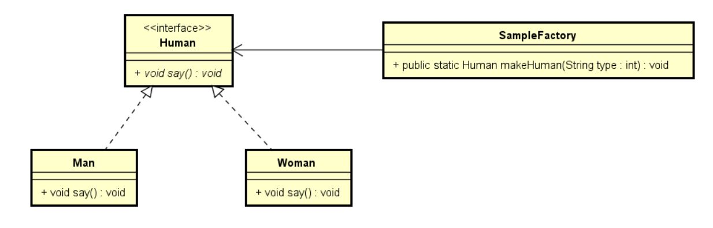

# Java简单工厂模式以及来自lambda的优化

---

# 前言
&emsp;&emsp; 设计模式是软件工程中一些问题的统一解决方案的模型,它的出现是为了解决一些普遍存在的,却不能被语言特性直接解决的问题,随着软件工程的发展,设计模式也会不断的进行更新,本文介绍的是经典设计模式-简单工厂模式以及来自java8的lambda的对它的优化。

# 什么是简单工厂模式

## 概念
> 定义一个工厂类，对实现了同一接口的一些类进行实例的创建。简单工厂模式的实质是由一个工厂类根据传入的参数，动态决定应该创建哪一个产品类（这些产品类继承自一个父类或接口）的实例

## 简单理解
&emsp;&emsp;我的理解是工厂模式好比一个容器,里面装了有许多共同特征的对象,通提供过工厂对外提供的方法向外提供实例化子类的功能,和现实的中的工厂很像。简明点说,是许多对象的集合,根据需求对外提供不同的对象。

# 例子
## 场景描述
在写了几个设计模式之后我发现每次要虚构一个不存在的例子很费脑筋，于是我决定后面的例子用我平常喜欢玩的一些游戏来描述，感觉会更有意思:)。
在一片古老的魔法大陆上，有许多隐世的秘宝等待探险者去挖掘，可这样的机会往往也伴随着危险，所以探险者们往往需要结伴而行，一般来说，一个不会在野外直接当掉的队伍至少需要保证三种类型的职业(坦克,输出,治疗,俗称'铁三角')。因此，在这样的需求下，久而久之，魔法大路上诞生了一家'冒险者雇佣兵工厂'，没有人知道这家工厂是何时诞生，也不知道里面究竟有怎样的实力...只是知道，你给它钱，和你需要的职业，它就会提供一个对应职业的雇佣兵助你完成这次冒险....
有一天,有一个战士(坦克)阿呆收到消息，有一个叫做'火焰洞窟'里面可能有好东西，可他身边没有伙伴一个人显然是不能去送死的，于是为了快速凑到伙伴，他想到了雇佣兵工厂...他需要一个能够释放冰霜法术的法师(输出)(冰属性可以克制火焰洞窟里的怪物)和一个能够疗伤的牧师(治疗)这两个职业,下面在客户端中模拟场景

## 传统实现
首页抽象坦克,输出,治疗为探险者接口,提供一个战斗的技能的方法
探险者接口
```java
public interface adventurer {
    /**
     * 使用战斗技能
     */
    void useBattleSkill();
}
```

战士,冰霜法师,牧师实现探险者接口,作为子类提供不同的战斗技能实现
战士类
```java
public class warrior implements adventurer {
    @Override
    public void useBattleSkill() {
        System.out.println("盾牌格挡!");
    }
}
```
冰霜法师类
```java
public class frostMage implements adventurer {
    @Override
    public void useBattleSkill() {
        System.out.println("寒冰箭!");
    }
}
```
牧师类
```java
public class priests implements adventurer {
    @Override
    public void useBattleSkill() {
        System.out.println("快速治疗!");
    }
}
```

冒险者工厂类,根据不同的职业需求实例化不同的冒险者给客户端
```java
public class adventFactory {

    public static adventurer createAdventurer(String professionType) {
        adventurer adventurer;
        switch (professionType) {
            case "战士":
                adventurer = new warrior();
                break;
            case "冰霜法师":
                adventurer = new frostMage();
                break;
            case "牧师":
                adventurer = new priests();
                break;
            default:
                throw new IllegalArgumentException("我们没这种职业!");
        }
        return adventurer;
    }
}
```

客户端类,模拟三个职业进入火焰洞窟并使用各自的技能
```java
public class Client {
    public static void main(String[] args) {
        //通过冒险者工厂实例化出战士,冰霜法师,牧师
        adventurer warrior = adventFactory.createAdventurer("战士");
        adventurer frostMage = adventFactory.createAdventurer("冰霜法师");
        adventurer priest = adventFactory.createAdventurer("牧师");
        //进入火焰洞窟
        System.out.println("================进入火焰洞窟================");
        warrior.useBattleSkill();
        frostMage.useBattleSkill();
        priest.useBattleSkill();
    }
}
```

控制台结果
```
================进入火焰洞窟================
盾牌格挡!
寒冰箭!
快速治疗!
```

如同上文所讲,雇佣兵工厂通过switch语句根据不同的输出实例化不同的对象给客户端调用,这样客户端只需要和工厂打交道,有什么需求提供给工厂,工厂实例化出对应对象返回,所以工厂可以理解为是对象实例化的集合。

## 总结与思考
### 总结
为了增加趣味性(主要是我自己的..编例子很无聊T_T),本文使用了MMORPG游戏的铁三角的组队进副本的例子,冒险者工厂为冒险者提供不同职业的冒险者,冒险者不需要与具体的同伴沟通,通过工厂就可以完成需求,可以说是将需求者与雇佣兵这两类人给解耦了,通过冒险工厂来交互。从封装角度来说，之前写的命令模式，策略模式都是对行为的封装，而工厂模式是对对象构造器的封装，这一点也为后面的lambda的优化选择接口提供了依据。
下面是uml图


### 优点
- 解耦,将需求类与实现类分离开了，通过工厂类进行交互
- 无论是添加，修改还是删除新的子类，都十分的容易，不会影响到其他的类
- 复用，子类可以多次复用，而不是每次都需要复制原先的代码

### 可优化点
- 依旧是针对switch语句的优化
- 违背了开闭原则,即增加新的子类之后,原先的工厂类的代码还需要做改动,开放了修改

### 优化思路
- 传统使用反射来完成修改的关闭,这里我不想使用反射来完成,试试lambda能否完成它的职责

## 使用lambda进行优化
前面提到简单工厂模式的封装模式是对对象的构造进行封装,那么如果采用函数接口替换switch语句的话,选择的函数应该是`Supplier<T>`(无参构造函数) 或者`Funtion<T,R>`(有参构造函数),这里我们选择无参构造函数来进行优化,使用Map存储这些构造方法,并利用函数语言的懒加载特性,使得直到真正调用实例化对象的某一方法时,才真正调用构造函数,代码如下。

使用supplier封装构造器优化后的Factory类
```java
public class adventFactory {
    private static final Map<String, Optional<Supplier<adventurer>>> MAP = new ConcurrentHashMap<>();

    static {
        MAP.put("战士", Optional.of(warrior::new));
        MAP.put("冰霜法师", Optional.of(frostMage::new));
        MAP.put("牧师", Optional.of(priests::new));
    }

    public static adventurer createAdventurer(String professionType) {
        //get(professionType)获得optional对象,orElseThrow用于防止或者异常参数,get()及早求值,执行对象的实例化,直到这一步函数才真正的执行
        return MAP.get(professionType)
                .orElseThrow(() -> new IllegalArgumentException("我们工厂没这种职业!"))
                .get();
    }
}
```

客户端代码与原先一模一样，这里就不显示了，下面说明一下这个Factory类。
使用supplier函数接口将构造器封装,并存储在MAP中，注意这里与传统的直接存实例好的对象进去不同，这里存储的只是构造过程，并不会真正的占用空间，除非客户端调用create方法需要这个对象了,才会实例化出来，这里利用了函数的懒加载特性。同时为了防止可恶的空指针异常或者是需求并不存在的类,在supplier的基础上使用了optional类进行包装,避免了各类if判断,可以看出使用了lambda优化之后,已经不存在任何的条件判断语句(switch,if)了，将面向对象与函数语言特性相结合，感觉很不错。

## 枚举的进一步优化
前面提到可优化点的时候提到了简单工厂方法违背了开闭原则，然而经过lambda优化之后的方式虽然消除了switch与if分支,但是似乎并没有克服这个问题,工厂类依旧是违背这个原则的,那么可不可能再次优化呢？我认为这种需要传入魔法值来做一些事情的方法或者设计模式,枚举都是一个不错的选择，下面尝试使用枚举。

使用枚举变量封装这些构造器,这样不仅可以使得工厂可以将修改关闭,同时也省去了optional类的包装,因为你传入的参数只能是枚举变量已经定义好的。下面是代码。

枚举类,内部存一个supplier对象,存放各大职业的构造器,对外暴露getConstructor方法进行实例化
```java
public enum adventEnum {
    WARRIOR(warrior::new),
    MAGE_FROST(frostMage::new),
    PRIESTS(priests::new);

    private final Supplier<adventurer> constructor;

    adventEnum(Supplier<adventurer> constructor) {
        this.constructor = constructor;
    }

    public Supplier<adventurer> getConstructor() {
        return constructor;
    }
}
```

工厂类
```java
public class adventFactory {
    public static adventurer createAdventurer(adventEnum adventEnum) {
        adventEnum.getConstructor().get();
    }
}
```
工厂类十分简洁,然而不仅简洁,还完美继承了上面的所有优势,并且克服了劣势。

客户端
```java
import static com.lambda.enums.adventEnum.*;

public class Client {
    public static void main(String[] args) {
        //通过冒险者工厂实例化出战士,冰霜法师,牧师
        adventurer warrior = adventFactory.createAdventurer(WARRIOR);
        adventurer frostMage = adventFactory.createAdventurer(MAGE_FROST);
        adventurer priest = adventFactory.createAdventurer(PRIESTS);
        //进入火焰洞窟
        System.out.println("================进入火焰洞窟================");
        warrior.useBattleSkill();
        frostMage.useBattleSkill();
        priest.useBattleSkill();
    }
}
```
客户端的调用参数变成了枚举类,这里静态导入枚举类,我一直觉得使用枚举变量的代码拥有一种自注释的特性,即不需写注释就可以看的很明了。

# 结尾
麻雀虽小，五脏俱全，例子很简单，但是最后的成果是`面向对象语言+函数式语言+枚举`的结合，可以看到这种组合效果是十分棒的，代码不仅简洁易用性高同时还保持了健壮性与可扩展性，希望大家可以多尝试，我认为多种语言范式的组合的语言可能是第三代语言或者更新的语言发展的趋势吧(Scala，C#等)^_^，大家下篇再见。

# 关于本文代码
本文的代码与md文章同步更新在github中的[simple-factory-mode](https://github.com/xhyrzldf/design-patterns/blob/master/strategy-mode/strategy-mode.md)模块下,欢迎fork :)


